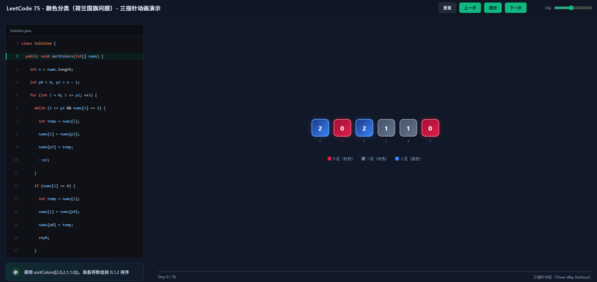

<p align="center">
  
  
  
</p>

<h1 align="center">Claude Algorithm Visualizer</h1>

<p align="center">
  <b>一句话：任何力扣 / 算法题解，一键生成电影级交互式步骤动画。</b>
</p>

<p align="center">
  <a href="README.md"></a>
</p>

---

## 效果演示

<p align="center">
  
</p>

---

## 功能特性

| 功能 | 说明 |
|---------|-------------|
| **一命令生成** | 粘贴代码 + 测试用例 → 秒级输出 `.html` 演示页 |
| **电影级深色 UI** | 深空暗色主题，配合霓虹渐变与发光特效，灵感来源于专业 IDE |
| **代码高亮同步** | 当前执行行随动画帧逐行高亮，双向可跟踪 |
| **智能状态卡片** | 每一步都有中文人读解释，新手友好 |
| **零依赖** | 单文件 `.html`，无需构建、无需 CDN、断网可用 |
| **完整播放控制** | 播放 / 暂停 / 上一步 / 下一步 / 重置 / 速率调节 (0.2x–2.0x) |
| **键盘驱动** | ← → 空格键，播放时操控无需鼠标 |
| **响应式布局** | 小于 900px 自动折叠为上下布局 |
| **多模式支持** | 单数组、双数组、二维网格、链表、树形结构 |

---

## 快速开始

### 1. 安装 Skill

将 `skill/` 文件夹（或打包好的 `.skill` 文件）放入 Claude Code 的 skills 目录，然后重启 Claude Code。

```bash
# macOS / Linux
~/.claude/skills/algo-visualizer/

# Windows
%USERPROFILE%\.claude\skills\algo-visualizer\
```

### 2. 调用

在任意 Claude Code 对话中，直接输入：

```
/algo-visualizer
```

然后提供：
- 你的 **力扣题目号 / 标题**（可选，用于上下文）
- 你的 **解题代码**
- 一个 **小规模测试用例**（5–10 个元素）

Claude 会生成一个 `problem-name-demo.html` 文件，直接用浏览器打开即可。

### 3. 录屏 & 分享

打开 HTML 页面，点击 **播放**，然后使用屏幕录制工具（OBS、LICEcap、ScreenToGif）捕捉动画。适用于：
-  算法讲解视频
-  科技串文爆款
-  作品集背书

---

## 适配模型

| 平台 | 状态 | 说明 |
|----------|--------|-------|
| **Claude Code (CLI)** | ✅ 完全支持 | 主要目标平台；通过 `/algo-visualizer` 唤醒 |
| **Claude 4.x (Sonnet/Opus)** | ✅ 完全支持 | 代码生成与推理能力最强 |
| **Claude 3.5/3.7 Sonnet** | ✅ 支持 | 复杂 DP 场景可能需要更多引导 |
| **其他 Claude 接入方式** | ⚠️ 手动加载 | 将 `SKILL.md` 内容复制到系统提示词中 |

---

## 优化亮点

> 为 **上下文窗口效率** 与 **视觉冲击力** 而设计。

1. **渐进式披露架构 (Progressive Disclosure)**
   - `SKILL.md` 仅加载核心工作流（约 8KB）；沉重的 HTML 脚手架存放于 `assets/template.html`
   - 避免多 Skill 并发时的上下文膨胀

2. **Token 效率极致的 CSS 框架**
   - `:root` CSS 变量确保主题一致无需重复定义
   - 所有动画均使用 GPU 合成属性（`transform`、`opacity`），保证 60fps 流畅度

3. **确定性步骤引擎**
   - `buildSteps()` 用纯 JavaScript 模拟算法逻辑，而非 `eval()` —— 安全、可预测、可调试
   - 每个 step 都是纯状态快照；`render()` 是幂等的

4. **运动设计系统**
   - 指针过渡使用弹性贝塞尔曲线 `[0.34, 1.56, 0.64, 1]`，带来轻盈的跳动感
   - 完成时的 `sortedPop` 错开动画营造「奖励感」
   - 比较热点的黄色 `borderPulse` 脉冲高亮，瞬间抓住视线

5. **无障碍体验**
   - 键盘快捷键减少演讲者操作摩擦
   - 速率滑块 (0.2x–2.0x) 适配不同受众：新手慢放，老鸟快进
   - 状态信息采用中文，符合主要用户群体语言习惯

---

## 项目结构

```
claude-algo-visualizer/
├── skill/                          # Claude Code Skill 套件
│   ├── SKILL.md                    # Skill 清单 & 工作流指令
│   ├── _meta.json                  # 元数据
│   └── assets/
│       └── template.html           # 可复用 HTML 脚手架（CSS + JS 引擎）
├── demo/
│   └── sort-colors-demo.html     # 力扣 75 — 色彩分类（荷兰国旗）
├── README.md                       # 英文文档
├── README.zh.md                    # 中文文档（本文件）
└── LICENSE                         # MIT 协议
```

---

## 演示集

| 题目 | 算法 | 文件 |
|---------|-----------|------|
| LeetCode 75 — 色彩分类 | 三路快排 | `demo/sort-colors-demo.html` |
| LeetCode 1855 — 下标对中的最大距离 | 单调双指针 | *（用 Skill 生成）* |
| LeetCode 3 — 无重复字符的最长子串 | 滑动窗口 | *（用 Skill 生成）* |

> 想让你的演示上榜？提交 PR ，附上你生成的 `.html`！

---

## 开源协议

MIT © 2026

---

<p align="center">
  如果这个 Skill 帮你拿到了 Offer 或者火了，记得点个 ⭐ 分享你的故事！
</p>
